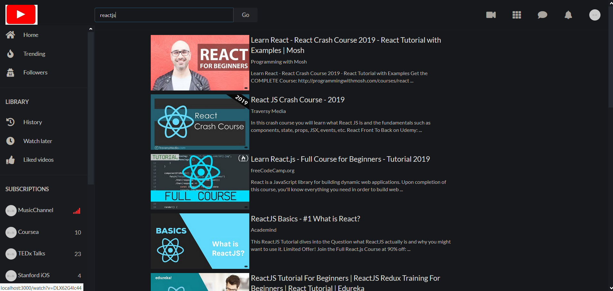
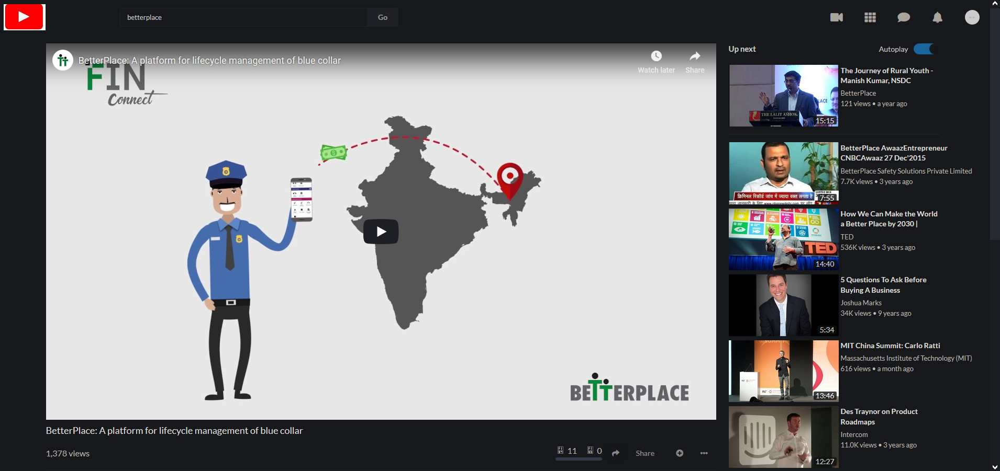
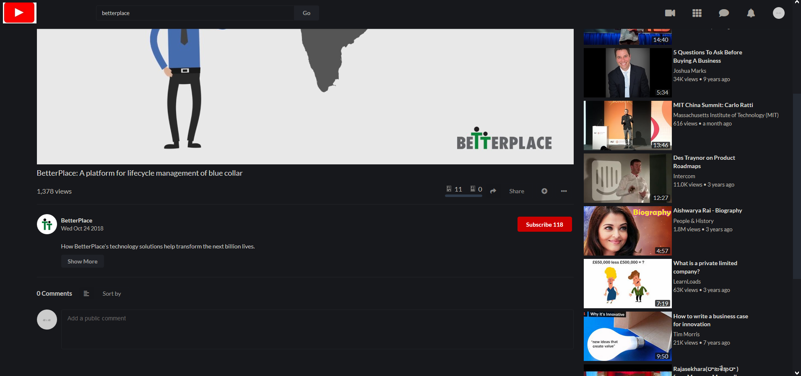

# 1 About
This repository is the source code for  to create a full stack web-app for an aggregator of top Youtube channels.

# Features
This application includes the major features of Youtube such as
* Rank 
* Grade 
* views 
* Channel name
* Uploads
* Subscribers
* home feed with infinite scroll
* trending videos
* searching for videos
* watching videos
* displaying comments and video details


# 2 Screenshots
UI-wise this application looks **almost exactly like the original Youtube application**

It uses real data by leveraging the [Youtube Data API v3](https://developers.google.com/youtube/v3/docs/).







# 3 How to run this application
This application loads information using the [Youtube Data API v3](https://developers.google.com/youtube/v3/docs/).

To use it, you need to set up a [Youtube Data v3 API key](https://productioncoder.com/build-youtube-in-react-part-19/) and run the project with `npm` or `yarn`.

**Below, you'll find a step by step explanation**


## 3.1. Getting a Youtube Data API key
1. Head over to the [Google developers console](https://console.developers.google.com)
2. Create a new project by clicking on `Select project` drop down right next to the logo. Click the `New Project` button an give it a speaking name.
3. Select your project by choosing it in the `Select Dropdown` directly next to the logo in the header.
4. Click the `Enable APIs and Services` button
5. Search for `youtube data`
6. Click on the `Youtube Data API v3`
7. Click the blue enable button
8. In the dashboard, click `Credentials` on the left sidebar
9. Click the `Create Credential` button
10. Which API are you using: `Youtube Data API v3`
11. Where will you be calling the API from: `Web browser`
12. What data are you accessing: `Public data`
13. Click the `What credentials do I need button`
14. **Copy the API key, and paste it into `src/App.js`**
```
const API_KEY = 'AIzaxxxxxxxxxxxxxxxxxxxxxxxxxxxxxxxxxx';
```

## 3.2. Install the dependencies
Install the dependencies by running
```
npm install
```

If you are using [yarn](https://yarnpkg.com/lang/en/), please run
```
yarn install
```

## 3.3. Running the application
**To run the application, execute**
```
npm start
```
or with [yarn](https://yarnpkg.com/lang/en/)
```
yarn start
```


# 4 Tests
This project contains an extensive suite of tests and makes use of [Jest](https://jestjs.io/) and [Enzyme](https://github.com/airbnb/enzyme).

Run all tests by executing.

```
npm test
```

You can also use [yarn](https://yarnpkg.com/lang/en/) to run the tests.
```
yarn test
```


# Technologies Used
* [React / create-react-app](https://github.com/facebook/create-react-app)
* [Redux](https://redux.js.org/)
* [Redux-saga](https://redux-saga.js.org/)
* [Redux-reselect](https://github.com/reduxjs/reselect)
* [Jest](https://jestjs.io/)
* [Enzyme](https://airbnb.io/enzyme/)
* [Semantic UI](https://react.semantic-ui.com/)
* CSS Grid / Flexbox


# 5 Disclaimer
This project is **solely made for challenge purpose** and is created under **fair use**.

It is **not intended to create any kind of Youtube competitor**, but to teach advanced concepts in frontend development.
